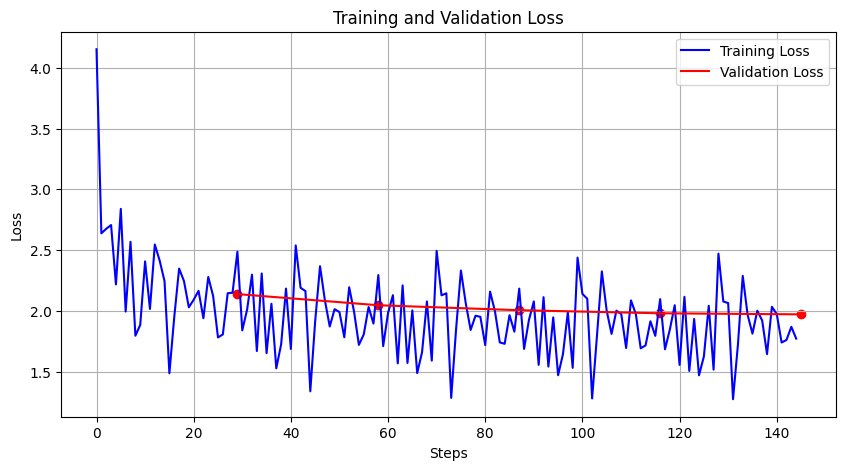

# Train - Self-Attention & Decoder Transformer

In this project, I have implemented a self-attention mechanism from scratch. The model has been trained on Shakespeare's text using a character-level tokenizer. The self-attention mechanism allows the model to weigh the importance of different characters in the input sequence, enabling it to capture long-range dependencies and improve the quality of text generation.

Additionally, I have implemented a Transformer decoder from scratch and trained it on the same dataset. The decoder was used to generate text based on the input sequence.

## Implementation Details

- **Self-Attention Mechanism**: The core component of the model, responsible for dynamically focusing on relevant parts of the input sequence.
- **Character-Level Tokenizer**: Tokenizes the input text at the character level, allowing the model to work with a fine-grained representation of the text.
- **Transformer Decoder**: A custom implementation of the Transformer decoder, trained to generate text after being provided with an input sequence.
- **Training Data**: The complete works of Shakespeare, providing a rich and diverse dataset for training the model.

## Results

After 1 epoch of training, the generated text looks like this:

```
nonowhe ar
e blllvica
rmue s lll
as thare h
y vare

As
mathay.

TEiyevore
 s the be 
o y ot, pe
 sse a t a
```

After 5 epochs, the generated text becomes more coherent:

```
rt aueris 
Tain live 
ss ss,.
A:

Could,
A
:
I t se s
ede p werl
ctat t I's
er'd ff We
rer ard he
n w larn g
```




## Conclusion
We can observe that, with more epochs, the model begins to use more full words and meaningful patterns. Although the results are still not perfect, further hyperparameter tuning and more training epochs would likely improve the text generation quality.
This project was inspired by Andrej Karpathy's Transformer Tutorial [this YouTube video](https://www.youtube.com/watch?v=kCc8FmEb1nY&t=1829s) and was primarily done to gain a deeper understanding of how transformers work, with the additional opportunity to experiment with the transformer architecture to gain some pratical experience.